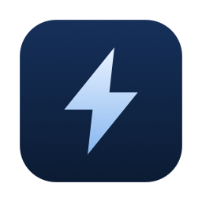
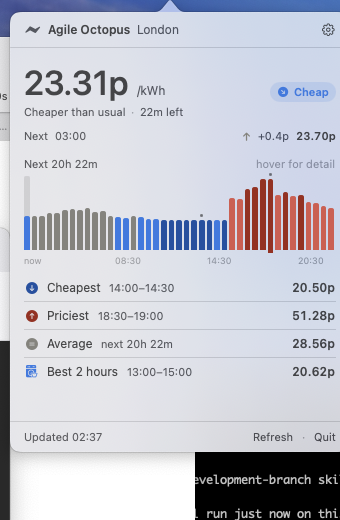
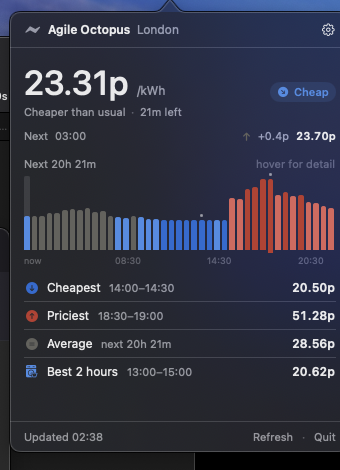
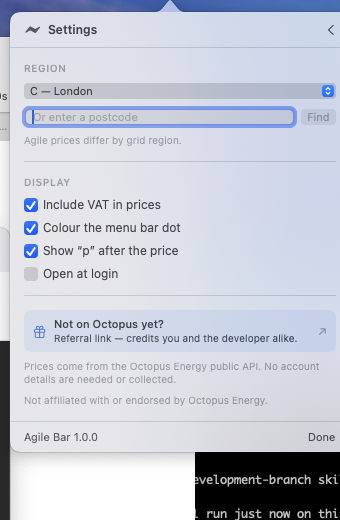

<div align="center">



# Agile Bar

**The current Octopus Agile electricity price, in your macOS menu bar.**

</div>

Agile Octopus prices change every half hour. Agile Bar keeps the live unit rate
in the menu bar and, on click, answers the question that actually matters — *is
now a good time to put the washing on?*

<div align="center">


</div>

## What it shows

**In the menu bar** — the current half-hour unit rate, with a coloured dot
showing how it compares with the rest of the day.

**On click**

- the live price, how long is left in the slot, and a plain-English verdict
- the next slot and the change from now
- every published half hour as a bar chart, hover for exact figures
- the cheapest and priciest slots ahead, and the average
- the **cheapest contiguous two hours** — for the dishwasher, the EV, the dryer

It updates itself: the displayed slot rolls over within 30 seconds of each half
hour, prices are re-fetched every 15 minutes, and it catches up immediately when
your Mac wakes.

### About that 24 hours

Octopus publishes the next day's prices in the late afternoon. Before then, less
than 24 hours is actually known — so the app says how far ahead it can really
see ("next 20h 31m") rather than implying a full day of data it doesn't have.

## Colour

Prices are coloured on a **diverging scale around the middle of the visible
window**: blue for cheaper than usual, grey for typical, red for dearer. It
re-bases itself every day, so it stays meaningful as the wholesale market moves
instead of relying on thresholds that go stale.

Both arms are single-hue ramps, monotone in lightness, validated for
colour-vision deficiency and for contrast against the light and dark surfaces
separately. Colour never carries meaning on its own — every use is paired with a
text label, and the chart's extremes are marked as well as coloured.

Negative prices get their own treatment: Agile really does go below zero, and the
chart keeps a true zero baseline so those slots read as what they are.

## Installing

Requires macOS 14 or later.

```sh
git clone https://github.com/<you>/octo_status_bar.git
cd octo_status_bar
./Tools/make-icon.sh     # generates the app icon
./build.sh               # builds build/OctoStatusBar.app
open build/OctoStatusBar.app
```

Then open the popover and click the gear — the card flips over — and set your
region, either by picking it from the list or by typing a postcode and letting
the app look the region up.

<div align="center">

</div>

To develop without bundling, `swift build && swift run`. Note that "Open at
login" needs a real app bundle, so it is inert under `swift run`.

## Data and privacy

Prices come from the [Octopus Energy public
API](https://developer.octopus.energy/rest/guides/endpoints). Everything the app
uses is public and unauthenticated — **no account, API key, or MPAN is needed or
collected**, and there is no analytics or tracking of any kind. See
[PRIVACY.md](PRIVACY.md).

The app resolves the current Agile product code at runtime rather than hardcoding
it, so it keeps working when Octopus supersedes the tariff.

## Prior art and alternatives

Agile Bar is not the first app to put Octopus Agile prices in a menu bar, and it
would be poor form to pretend otherwise. Surveyed August 2026 — the store moves,
so treat this as a snapshot rather than gospel.

**Also puts Agile prices in the macOS menu bar**

| Project | What it is |
|---|---|
| [OctopusAgilePrice / "OctoNow"](https://apps.apple.com/gb/app/octopusagileprice/id6757762911) | The closest thing to this app. Native Mac-only, free. Current Agile price, upcoming rates and cheapest windows — but the menu bar headline is live consumption from an **Octopus Mini**, so it wants both an account and the hardware. |
| [WattSaver for Octopus Energy](https://apps.apple.com/gb/app/wattsaver-for-octopus-energy/id6689521694) | The most polished of the bunch and very actively maintained. A universal iPhone/iPad/Mac appliance scheduler; the Mac menu bar readout is one feature of many. Free with a Pro purchase. |
| [abracadabra50/open-octopus](https://github.com/abracadabra50/open-octopus) | Open-source Python + SwiftUI menu bar app with live rates and an off-peak countdown. Needs an API key, account number and MPAN. |

**Adjacent, but not menu bar apps**

[Octoglance](https://apps.apple.com/gb/app/octoglance-agile-and-tracker/id6753656037)
(widgets and watch complications; runs on Apple Silicon Macs as an iPad app),
[Agile Watcher](https://apps.apple.com/gb/app/octopus-energy-agile-watcher/id1499880851)
(a windowed app, and the long-standing incumbent),
[Octopus Usage Insights](https://apps.apple.com/gb/app/octopus-usage-insights/id6754394593)
(consumption charts rather than prices),
[Wattora](https://apps.apple.com/gb/app/wattora-electricity-prices/id6759666880)
(European ENTSO-E spot prices, not Octopus), and
[nedrichards/octopus-agile-energy](https://github.com/nedrichards/octopus-agile-energy)
(GTK4, for GNOME).

Unrelated despite the name: [Octobar](https://octobar.app/) is a general-purpose
menu bar utility and has nothing to do with energy.

**So why this one?** Every alternative above is gated behind an Octopus account,
an API key, or a piece of hardware. Agile Bar asks for none of them — it reads
the same public tariff endpoints anyone can curl, so there are no credentials to
store, leak, or revoke, and it works before you have switched supplier as easily
as after. It also leads with the price rather than with consumption, and it is a
real menu bar app rather than an iPad app in a window.

If one of the above suits you better, use it. They are good, and the author of
this one is not trying to win an argument.

## Distribution

Day-to-day builds use the Swift package (`./build.sh`). The generated
`.xcodeproj`, the `.icns`, and everything under `build/` are gitignored — they
are build artefacts, and the drawing code and package manifest are the source of
truth.

### Publishing to the Mac App Store

Enrol in the Apple Developer Program, register the bundle ID
`io.reneo.OctoStatusBar` under Certificates, Identifiers & Profiles, and create a
matching app record in App Store Connect. Then generate the Xcode project, which
compiles exactly the same sources as the package:

```sh
brew install xcodegen
./Tools/make-icon.sh
xcodegen generate
open OctoStatusBar.xcodeproj
```

In the target's Signing & Capabilities tab, tick "Automatically manage signing"
and pick your team — that fills in the `DEVELOPMENT_TEAM` deliberately left blank
in [`project.yml`](project.yml) so the repo carries no identity, and lets Xcode
mint the distribution certificate and provisioning profile. Confirm App Sandbox
is on with only **Outgoing Connections (Client)** ticked, matching
[`Resources/OctoStatusBar.entitlements`](Resources/OctoStatusBar.entitlements);
anything extra invites review questions. Set the destination to "Any Mac", then
Product → Archive, and in the Organizer choose Distribute App → App Store Connect
→ Upload.

Things that reliably trip people up:

- **The privacy policy needs a public URL.** [PRIVACY.md](PRIVACY.md) in the repo
  is not enough — host it somewhere and put the URL in App Store Connect.
- **Screenshots must be 1280×800, 1440×900, 2560×1600 or 2880×1800.** The images
  in `docs/` are far too small; compose the popover onto a desktop background.
- **Explain the menu bar in the Review Notes.** `LSUIElement` apps open no window
  and show no Dock icon, and reviewers have reported such apps as "not
  launching". Say explicitly that the price appears in the menu bar at the
  top-right and that clicking it opens the interface, and mention that prices are
  UK-only.
- **Bump `CURRENT_PROJECT_VERSION` for every upload.** App Store Connect rejects
  a duplicate build number even if the previous build was deleted.
- **If validation complains about the icon**, convert `Resources/AppIcon.icns`
  into an `Assets.xcassets` AppIcon set. The `.icns` already contains the
  required 1024px variant, so try it as-is first.
- Export compliance is already declared via `ITSAppUsesNonExemptEncryption` in
  [`Resources/Info.plist`](Resources/Info.plist), so you will not be asked about
  it on each upload.

Answer the App Privacy questionnaire as **Data Not Collected** — that is
accurate, and [PRIVACY.md](PRIVACY.md) spells out why.

## Referral link

Settings contains an Octopus Energy referral link. If you sign up through it,
Octopus credits both you and the author of this app — that is disclosed in the
app itself, and it is tucked away on the settings pane rather than put in front
of the prices. Nothing about the app changes if you ignore it, and no referral
or tracking data reaches this project either way.

## Licence

MIT — see [LICENSE](LICENSE).

## Disclaimer

This is an independent, unofficial project. It is **not affiliated with,
endorsed by, or supported by Octopus Energy**. "Octopus Energy" and "Agile
Octopus" are trademarks of Octopus Energy Ltd, used here only to describe what
the app displays.

Prices shown are for information only. Always check your Octopus account for
what you are actually billed.
